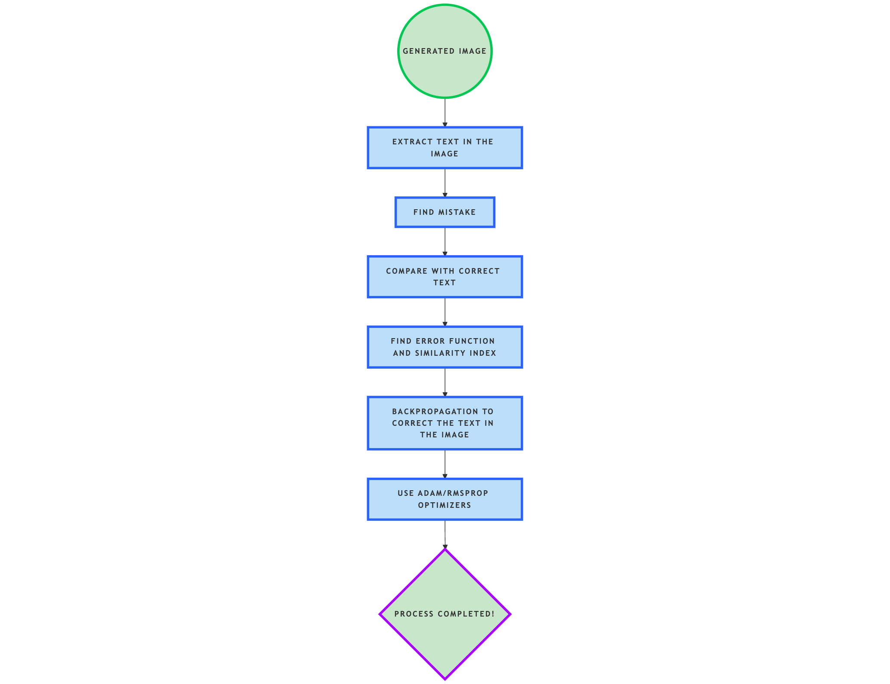

#### **1. Generate Image with Text**
- **Model**: [Stable Diffusion](https://huggingface.co/CompVis/stable-diffusion-v1-4) or [DALL-E](https://openai.com/dall-e/)
- **Task**: Generate an image containing specified text.

#### **2. Extract Text from the Image**
- **OCR Tool**: [Tesseract OCR](https://github.com/tesseract-ocr/tesseract) or [Google Vision API](https://cloud.google.com/vision/)
- **Task**: Extract text from the generated image into a string format.

#### **3. Compare Extracted Text with Correct Text**
- **Similarity Metric**:
  - [RapidFuzz](https://github.com/maxbachmann/RapidFuzz): Fast string similarity calculations (Levenshtein, Jaccard, etc.).
  - [NLTK's Sequence Matcher](https://www.nltk.org/_modules/nltk/metrics/distance.html): Basic sequence comparison for identifying errors.
- **Task**:
  - Find the difference between the extracted text and the correct text.
  - Calculate similarity index (e.g., Levenshtein distance or accuracy).

#### **4. Define Error Function**
- **Error Metric**:
  - [Cross-Entropy Loss](https://pytorch.org/docs/stable/generated/torch.nn.CrossEntropyLoss.html): Ideal for classification tasks (character-level corrections).
  - [MSE Loss](https://pytorch.org/docs/stable/generated/torch.nn.MSELoss.html): If using continuous vector representations.
- **Task**:
  - Quantify the error between predicted text and correct text for model optimization.

#### **5. Backpropagation for Text Correction**
- **Pretrained Text Models**:
  - [T5 Transformer](https://huggingface.co/t5-base): Text-to-text generation and correction.
  - [BERT](https://huggingface.co/bert-base-uncased): Useful for encoding and similarity matching.
  - [GPT Models](https://openai.com/gpt/): For generating updated text.
- **Task**:
  - Use the error function to update text-generation weights and iteratively minimize the error.

#### **6. Optimizers**
- **Adam Optimizer**: [PyTorch Adam](https://pytorch.org/docs/stable/optim.html#torch.optim.Adam)
- **RMSProp Optimizer**: [PyTorch RMSProp](https://pytorch.org/docs/stable/optim.html#torch.optim.RMSprop)
- **Task**:
  - Use the optimizer to adjust the weights of the model during training.

#### **7. Iterate and Output Corrected Image**
- **Vision-Language Models**:
  - [CLIP](https://huggingface.co/openai/clip-vit-base-patch32): Maintain image-text alignment.
- **Image Correction Task**:
  - Update the image text iteratively using the corrected text.

