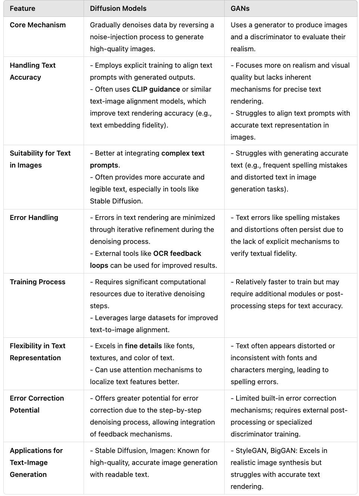

# CSE463 : Computer Vision

This course provides an introduction to computer vision including fundamentals of image
formation, camera imaging geometry, feature detection and matching, stereo, motion estimation
and tracking, image classification and scene understanding. We will explore methods for depth
recovery from stereo images, camera calibration, automated alignment, tracking, boundary
detection, and recognition. We will use both classical machine learning and deep learning to
approach these problems. The focus of the course is to develop the intuitions and mathematics of
the methods in lecture, and then to learn about the difference between theory and practice in the
projects.

## [Resources](https://drive.google.com/drive/folders/1q8VXDRMllyv_mftctnOzwQD3028Uz0AZ)

## [LAB RESOURCES](https://drive.google.com/drive/folders/113coBWGu9_RTipVciP6oSuHGDzYMKp2n)

## [Lab 1 : Introduction_to_Computer_Vision](https://drive.google.com/drive/folders/12ciHrB6xHeOugQWVFJYF8ueht8ppcli0)
[Notes](https://colab.research.google.com/drive/1mfi_-JZPQBZssFJG_oOz7HL6W0Sr4uFh)

## [Lab2 : Convolution and hybrid images](https://drive.google.com/drive/folders/1NN3HHAIjzERHAs6-gdHe2veWfNsrwJ6K?usp=drive_link)

## [Lab3](https://drive.google.com/drive/folders/1mSEdk_AjcihULvvC_et3hZQp9_DFky9S?usp=sharing)
## [Lab 4](https://drive.google.com/drive/folders/1J_mFpoxCNXOypVscNf7bkUKUoRrR6dEO?usp=sharing)

 # Project Notes

| **Feature**              | **Generative AI (GenAI)**                                     | **Generative Adversarial Networks (GAN)**                   |
|--------------------------|-------------------------------------------------------------|------------------------------------------------------------|
| **Definition**            | Broad AI field for generating content in various formats.    | A specific type of model designed for adversarial training to generate realistic data. |
| **Architecture**          | Often Transformer-based (e.g., GPT, BERT, Stable Diffusion). | Composed of two networks: Generator and Discriminator.      |
| **Training Method**       | Uses self-supervised or unsupervised learning to minimize a task-specific loss function. | Adversarial training where Generator and Discriminator compete. |
| **Applications**          | Text generation, image synthesis, multimodal tasks (e.g., ChatGPT, DALL-E). | Realistic image and video generation, style transfer, super-resolution. |
| **Versatility**           | Highly versatile, supports text, image, audio, and multimodal tasks. | Focused on structured data, primarily images and videos.    |
| **Strengths**             | Versatile, scalable, adaptable to various tasks via fine-tuning. | Creates highly realistic images and videos, excels in structured data generation. |
| **Weaknesses**            | Expensive training, potential for biased outputs, limited factual correctness. | Training instability, prone to mode collapse, limited application scope. |
| **Output Quality**        | Produces creative and diverse outputs, though not always realistic. | Excels at generating realistic and high-quality outputs, especially in images. |
| **Examples**              | ChatGPT, Stable Diffusion, MusicLM.                          | StyleGAN, DeepFake technologies, Pix2Pix.                  |

