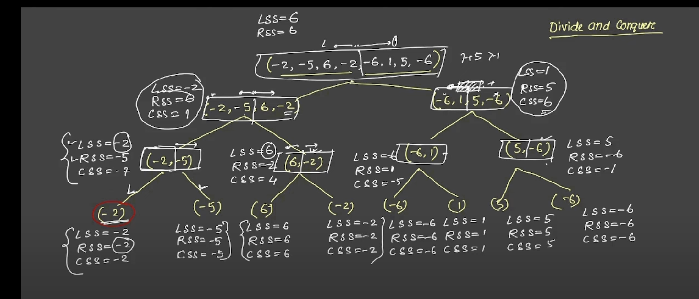
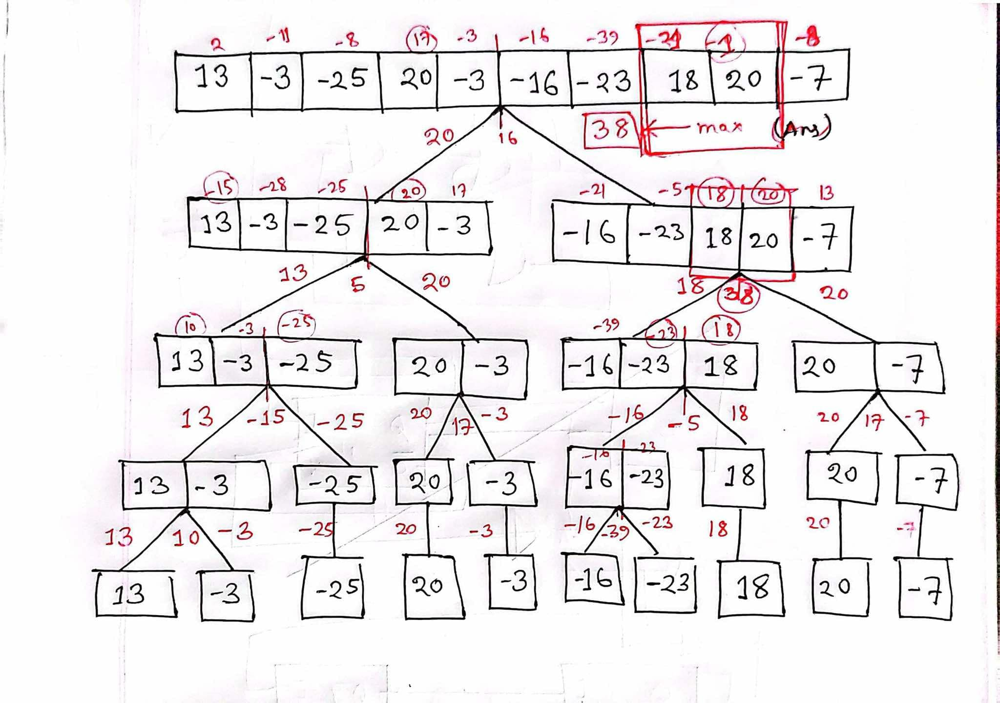
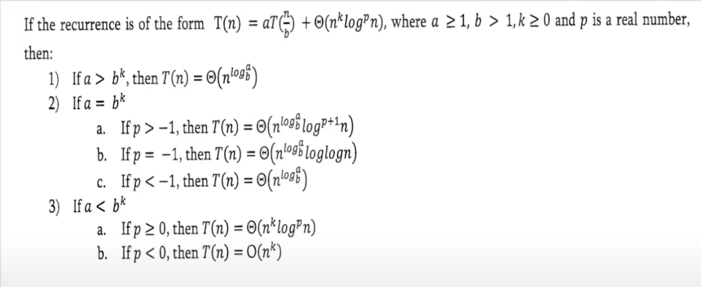
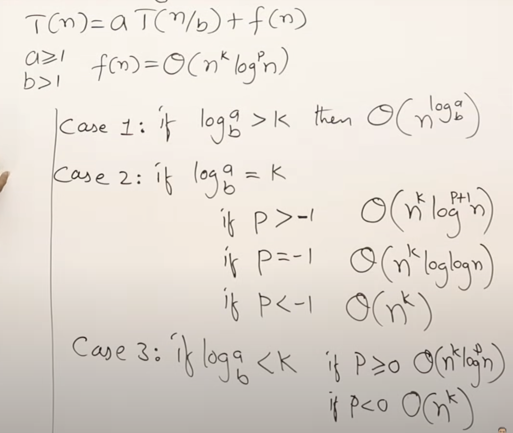
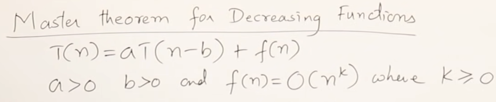
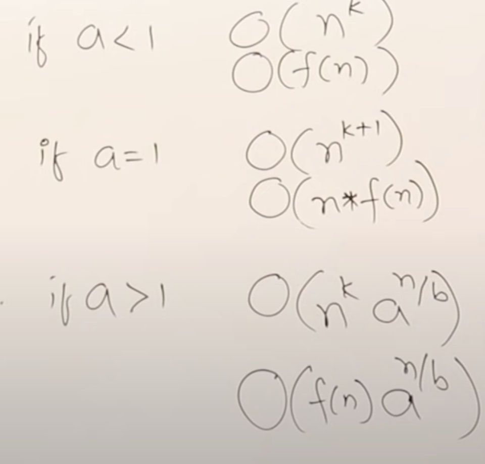

# Data Structures and Algorithms

**Resources:**
## 1.[Strivers A2Z DSA Course/Sheet](https://takeuforward.org/strivers-a2z-dsa-course/strivers-a2z-dsa-course-sheet-2/)
## 2.[Data Structures and Algorithm Coding Ninjas](https://www.codingninjas.com/studio/guided-paths/data-structures-algorithms?utm_source=youtube&utm_medium=organic&utm_campaign=dsa_roadmap_20_apr)


# [Common patterns used to solve LeetCode problems](#)

1. **Two Pointers**  
2. **Sorting**  
3. **Hashing**  
4. **Binary Search**  
5. **Sliding Window**  
6. **Backtracking**  
7. **Greedy Algorithm**  
8. **Divide and Conquer**  
9. **Dynamic Programming**  
10. **Depth-First Search (DFS)**  
11. **Breadth-First Search (BFS)**  
12. **Prefix Sum**  
13. **Union-Find (Disjoint Set Union)**  
14. **Bit Manipulation**  
15. **Stack and Monotonic Stack**  


## [Arrays](https://github.com/showrin20/BracU_Courses/blob/main/CSE220/Lab1.py)
1. Shift Left k Cells  
2. Rotate Left k Cells  
3. Shift Right k Cells  
4. Rotate Right k Cells  
5. Remove an Element  
6. Remove All Occurrences of a Particular Element  
7. Splitting an Array  
8. Max Bunch Count  
9. Mean and Standard Deviation Calculation  
10. Outlier Identification
11. Dutch National Flag Algorithm
12. Multidimensional Arrays


## 13. Kadane's Algorithm

### **Maximum Subarray Problem**
- **Problem Statement**: Find the contiguous subarray within a one-dimensional array of numbers that has the largest sum.  
- **Algorithm**: Kadane's Algorithm  
- **Key Points**:  
  - Initialize `max_current` and `max_global` to the first element of the array.  
  - Iterate through the array, updating `max_current` as `max(array[i], max_current + array[i])`.  
  - Update `max_global` whenever `max_current > max_global`.  
- **Attach Image/Diagram**:  
  *(Insert an image explaining the working of Kadane's Algorithm for Maximum Subarray)*

### **Code Implementation**
```python
def max_subarray(nums):
    max_current = nums[0]
    max_global = nums[0]

    for i in range(1, len(nums)):
        max_current = max(nums[i], max_current + nums[i])
        if max_current > max_global:
            max_global = max_current

    return max_global

# Example usage:
arr = [-2, 1, -3, 4, -1, 2, 1, -5, 4]
print("Maximum Subarray Sum:", max_subarray(arr))
```


## Recursion and Backtracking
1. Basic Recursion Questions
2. Divide and Conquer
3. Hard Recursion and Backtracking Questions

### **Divide and Conquer: Maximum Subarray Sum**
- **Problem Statement**: Find the contiguous subarray with the largest sum in an array using the Divide and Conquer approach.  
- **Key Idea**:
  - Divide the array into two halves.
  - Conquer each half recursively to find the maximum subarray sum in the left and right halves.
  - Combine the results by finding the maximum subarray sum that crosses the midpoint.  



### **Code Implementation**
```python
def max_crossing_sum(nums, left, mid, right):
    # Find the maximum sum on the left half
    left_sum = float('-inf')
    temp_sum = 0
    for i in range(mid, left - 1, -1):
        temp_sum += nums[i]
        if temp_sum > left_sum:
            left_sum = temp_sum

    # Find the maximum sum on the right half
    right_sum = float('-inf')
    temp_sum = 0
    for i in range(mid + 1, right + 1):
        temp_sum += nums[i]
        if temp_sum > right_sum:
            right_sum = temp_sum

    # Return the sum of the left and right parts
    return left_sum + right_sum

def max_subarray_divide_and_conquer(nums, left, right):
    # Base case: only one element
    if left == right:
        return nums[left]

    # Find the middle point
    mid = (left + right) // 2

    # Recursively find the maximum subarray sum in left, right, and cross
    left_max = max_subarray_divide_and_conquer(nums, left, mid)
    right_max = max_subarray_divide_and_conquer(nums, mid + 1, right)
    cross_max = max_crossing_sum(nums, left, mid, right)

    # Return the maximum of the three
    return max(left_max, right_max, cross_max)

# Example usage:
arr = [-2, 1, -3, 4, -1, 2, 1, -5, 4]
print("Maximum Subarray Sum (Divide and Conquer):", max_subarray_divide_and_conquer(arr, 0, len(arr) - 1))
```


### **Time Complexity**
- **Divide Step**: O(1) (Finding the middle index).  
- **Conquer Step**: Recursively solving two subproblems of size \(n/2\).  
- **Combine Step**: O(n) (Calculating the crossing sum).  
- **Total Complexity**: \(O(n \log n)\). 


## [Sorting Algorithms](https://github.com/showrin20/Data-Structure-and-Algorithm/tree/main/Sorting%20Algorithms)
1. Insertion Sort
2. Selection Sort
3. Merge Sort
4. Quick Sort
5. Heap Sort
6. Counting Sort
7. Radix Sort


## Linked Lists
1. Basic Linked List Operations
2. Reversal Problems
3. Sorting Problems
4. Slow and Fast Pointers
5. Modification in Linked List

## Stacks & Queues
1. Basic Stack and Queue Operations
2. Implementation Based Problems
3. Application Based Problems
4. Circular Queues
5. Deques - Hot Topic

## Hashmaps and Tries
1. Basic Hashmap Operations
2. Collision Resolution Techniques
3. Tries
4. Advanced Hashmap Problems

## Trees
1. Basic Tree Operations
2. Tree Traversals
3. Construction of Trees
4. Tree Views
5. Standard Problems
6. Binary Search Trees (BST)
   - Construction of BST
   - Conversion Based Problems
   - Modification in BST

## Heaps and Priority Queues
1. Basic Heap Operations
2. Implementation Based Problems
3. Conversion Based Problems
4. K Based Problems

## [Graphs](https://github.com/showrin20/Data-Structure-and-Algorithm/tree/main/Graph) 
1. Basic Graph Operations
2. Graph Traversals - BFS and DFS
3. Minimum Spanning Tree (MST)
4. Shortest Path Algorithms
5. Topological Sort
6. Graphs in Matrix
7. Strongly Connected Components


## Dynamic Programming
1. Basic DP Concepts
2. DP with Arrays
3. DP with Strings
4. DP with Mathematics
5. DP with Trees
6. Breaking and Partition Based Problems
7. Counting Based Problems

## Advanced Data Structures
1. Bit Manipulation
2. Greedy Algorithms
3. Doubly and Circular Linked Lists
4. String Algorithms like KMP and Z Algorithm


## Time Complexity
In this repository, we provide time complexity analysis for each algorithm based on different scenarios. The following scenarios are considered:

- **Worst Case**: This represents the scenario where the algorithm takes the maximum amount of time to run, typically occurring when the input data is in its most unfavorable state.

- **Best Case**: This represents the scenario where the algorithm takes the minimum amount of time to run, typically occurring when the input data is in its most favorable state.

- **Average Case**: This represents the scenario where the algorithm takes an average amount of time to run, typically occurring when the input data is randomly distributed.


# Master Theorem Overview

## Purpose
This guide explains the **Master Theorem**, a tool for solving recurrence relations in divide-and-conquer and subtract-and-conquer algorithms. It helps in analyzing algorithmic runtimes.


## Master Theorem for Divide and Conquer Recurrences
The general recurrence is:





## Master Theorem for Subtract and Conquer Recurrences
The general recurrence is:








## Limitations
The Master Theorem cannot be used if:
- **b ≤ 1** in **T(n) = aT(n/b) + c n^k**.
- The recurrence involves logarithms or non-polynomial functions.
- Subproblems are of unequal size.
- There are non-constant additive or non-polynomial growth terms.
- Multiple complex recurrences are combined.

## Examples
1. **Merge Sort**: **T(n) = 2T(n/2) + cn**
   - **a = 2, b = 2, k = 1**
   - Since **b^k == a**, **T(n) = Θ(n log n)** (Case 2).

2. **Binary Search**: **T(n) = T(n/2) + c**
   - **a = 1, b = 2, k = 0**
   - Since **b^k > a**, **T(n) = Θ(log n)** (Case 3).
     

# Basic Math Algorithms


1. **Euclid's Algorithm for GCD**:
   - It finds the greatest common divisor (GCD) of two numbers.
   - Uses a recursive method where the larger number is divided by the smaller one, and the process continues with the remainder until it becomes zero.

### 1. **Euclid's Algorithm for GCD**
```python
def gcd(a, b):
    while b != 0:
        a, b = b, a % b
    return a

# Example Usage
print("GCD of 56 and 98:", gcd(56, 98))
```

2. **Sieve of Eratosthenes**:
   - A technique for finding all prime numbers up to a specified number.
   - Works by iteratively marking multiples of each prime number starting from 2.
### 2. **Sieve of Eratosthenes**
```python
def sieve_of_eratosthenes(n):
    primes = [True] * (n + 1)
    primes[0] = primes[1] = False  # 0 and 1 are not prime numbers

    for i in range(2, int(n**0.5) + 1):
        if primes[i]:
            for j in range(i * i, n + 1, i):
                primes[j] = False

    return [i for i, is_prime in enumerate(primes) if is_prime]

# Example Usage
print("Prime numbers up to 30:", sieve_of_eratosthenes(30))
```


3. **Bit Manipulations**:
   - Involves performing operations at the bit level.
   - Utilizes bitwise operators like AND, OR, NOT, and XOR to manipulate bits efficiently. 


#### Swapping two numbers without using a temporary variable:
```python
def swap(a, b):
    a = a ^ b
    b = a ^ b
    a = a ^ b
    return a, b

# Example Usage
a, b = 5, 7
a, b = swap(a, b)
print("Swapped values: a =", a, ", b =", b)
```
