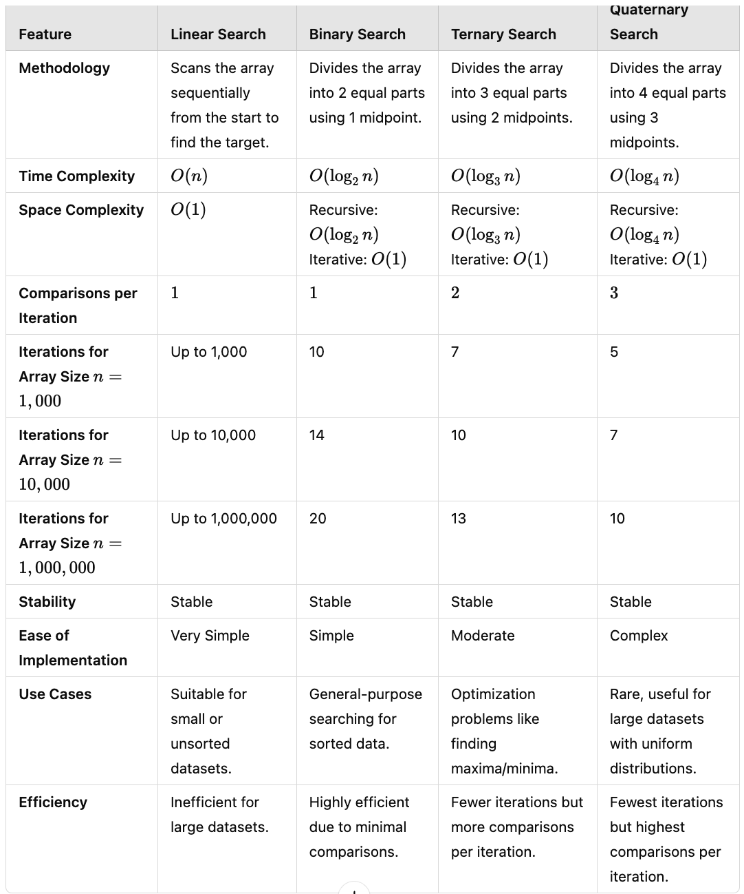

# Linear Search Algorithm

## Overview
Linear Search is a straightforward searching algorithm that checks each element in a list sequentially to find a specified key. It is simple and useful for small or unsorted datasets but is generally slower for large lists.

## Key Points
- **Algorithm Type**: Sequential Search
- **Time Complexity**: 
  - Best Case: O(1) (key is the first element)
  - Average and Worst Case: O(n)
- **Space Complexity**: O(1)
- **Use Case**: Useful for small, unsorted datasets or when simplicity is needed.

## How It Works
1. Iterate through each element of the list one by one.
2. Check if the current element matches the search key.
3. If a match is found, return or print the index.
4. If the entire list is traversed without finding the key, return or print `-1`.

## Implementation
```python
def linear_search(arr, key):
    for i in range(len(arr)):
        if arr[i] == key:
            print(i)
            return
    print(-1)

# Example
arr = [11, 77, 55, 9, 3]
key = 9
linear_search(arr, key)
```

# Binary Search Algorithm

## Overview
Binary Search is an efficient search algorithm that works on sorted arrays. It repeatedly divides the search interval in half, significantly reducing the number of comparisons required to find a target value compared to linear search.

## Key Points
- **Algorithm Type**: Divide and Conquer
- **Time Complexity**: 
  - Best Case: O(1) (if the middle element is the key)
  - Average and Worst Case: O(log n)
- **Space Complexity**: O(1) (iterative) or O(log n) (recursive)
- **Requirement**: The array must be sorted.
- **Use Case**: Ideal for large, sorted datasets.

## How It Works
1. Set the initial search range from the start (`l`) to the end (`r`) of the array.
2. Find the middle index (`mid`) of the current range.
3. If the middle element is the target (`key`), return the index.
4. If the middle element is less than the target, narrow the search to the right half.
5. If the middle element is greater than the target, narrow the search to the left half.
6. Repeat steps 2-5 until the target is found or the search range is empty.

## Implementation
```python
def binary_search(arr, key):
    l = 0
    r = len(arr) - 1
    
    while l <= r:
        mid = (l + r) // 2
        if arr[mid] == key:
            return mid
        elif arr[mid] < key:
            l = mid + 1
        else:
            r = mid - 1
    
    return -1

# Example with a sorted array
arr = [3, 9, 11, 55, 77]
key = 9
result = binary_search(arr, key)
print("Index of key:", result)
```
### Binary Search Recursive

```
def binary_search(arr, target, low, high):
    # Base case: if low exceeds high, the target is not in the array
    if low > high:
        return -1  # Target not found

    # Find the middle index
    mid = (low + high) // 2

    # Check if the target is at the middle
    if arr[mid] == target:
        return mid  # Target found at mid index
    # If the target is smaller, search the left half
    elif arr[mid] > target:
        return binary_search(arr, target, low, mid - 1)
    # If the target is larger, search the right half
    else:
        return binary_search(arr, target, mid + 1, high)
```


# Ternary Search Algorithm

## Overview
Ternary Search is a divide-and-conquer search algorithm similar to Binary Search but divides the search range into three parts instead of two. It’s used on sorted arrays to find a target value by recursively narrowing down the search range to either the left, middle, or right third.

## Key Points
- **Algorithm Type**: Divide and Conquer
- **Time Complexity**: 
  - Best Case: O(1) (if the key is found at the first check)
  - Average and Worst Case: O(log₃ n) (slightly slower than binary search in practice due to more comparisons)
- **Space Complexity**: O(1) (iterative) or O(log₃ n) (recursive)
- **Requirement**: The array must be sorted.
- **Use Case**: Primarily used in specific cases where ternary divisions can be leveraged, though often outperformed by binary search in most general use cases.

## How It Works
1. Define the search range from the start (`l`) to the end (`r`) of the array.
2. Divide this range into three parts by calculating two middle points: `mid1` and `mid2`.
   - `mid1 = l + (r - l) // 3`
   - `mid2 = r - (r - l) // 3`
3. Compare the target (`key`) with elements at `mid1` and `mid2`:
   - If the key matches `arr[mid1]`, return `mid1`.
   - If the key matches `arr[mid2]`, return `mid2`.
4. If the key is less than `arr[mid1]`, search in the left third.
5. If the key is greater than `arr[mid2]`, search in the right third.
6. If the key lies between `arr[mid1]` and `arr[mid2]`, search in the middle third.
7. Repeat steps 2-6 until the key is found or the search range is empty.

## Implementation
```python
def ternary_search(arr, key):
    l = 0
    r = len(arr) - 1
    
    while l <= r:
        mid1 = l + (r - l) // 3
        mid2 = r - (r - l) // 3

        if arr[mid1] == key:
            return mid1
        elif arr[mid2] == key:
            return mid2

        if key < arr[mid1]:
            r = mid1 - 1
        elif key > arr[mid2]:
            l = mid2 + 1
        else:
            l = mid1 + 1
            r = mid2 - 1

    return -1

# Example with a sorted array
arr = [1, 5, 9, 12, 15, 20, 25]
key = 12
result = ternary_search(arr, key)
print("Index of key:", result)
```


### Ternary Search Recursive

```python
def ternary_search(arr, target, low, high):
    # Base case: if low exceeds high, the target is not in the array
    if low > high:
        return -1  # Target not found

    # Calculate the first and second mid points
    mid1 = low + (high - low) // 3
    mid2 = high - (high - low) // 3

    # Check if the target is at either of the mid points
    if arr[mid1] == target:
        return mid1
    elif arr[mid2] == target:
        return mid2

    # Decide which part to search based on the target value
    if target < arr[mid1]:  # Search in the first third
        return ternary_search(arr, target, low, mid1 - 1)
    elif target > arr[mid2]:  # Search in the third third
        return ternary_search(arr, target, mid2 + 1, high)
    else:  # Search in the middle third
        return ternary_search(arr, target, mid1 + 1, mid2 - 1)

```

### Quarterly Search Algorithm

**Quarterly Search** is a modification of binary search that divides the search space into four equal parts instead of two. It recursively narrows down the search range by comparing the target with values at three partition points. This can potentially reduce the number of iterations in some cases by better leveraging the distribution of data.

### How Quarterly Search Works

1. **Divide the Array**: Split the array into four quarters using three partition indices:
   - \( Q1 = \text{low} + \frac{\text{high} - \text{low}}{4} \)
   - \( Q2 = \text{low} + 2 \times \frac{\text{high} - \text{low}}{4} \)
   - \( Q3 = \text{low} + 3 \times \frac{\text{high} - \text{low}}{4} \)

2. **Compare Target**:
   - If the target is less than the value at \( Q1 \), search the first quarter.
   - If it lies between \( Q1 \) and \( Q2 \), search the second quarter.
   - If it lies between \( Q2 \) and \( Q3 \), search the third quarter.
   - If it is greater than \( Q3 \), search the fourth quarter.

3. **Repeat Until Found**: Repeat the process until the search space is reduced to a single element or the target is found.

### Implementation

Here’s a Python implementation of Quarterly Search:

```python
def quarterly_search(arr, target, low, high):
    if low > high:
        return -1  # Target not found

    # Calculate partition indices
    q1 = low + (high - low) // 4
    q2 = low + 2 * (high - low) // 4
    q3 = low + 3 * (high - low) // 4

    # Compare the target with partition points
    if arr[q1] == target:
        return q1
    elif arr[q2] == target:
        return q2
    elif arr[q3] == target:
        return q3

    # Narrow down the search space
    if target < arr[q1]:
        return quarterly_search(arr, target, low, q1 - 1)
    elif target < arr[q2]:
        return quarterly_search(arr, target, q1 + 1, q2 - 1)
    elif target < arr[q3]:
        return quarterly_search(arr, target, q2 + 1, q3 - 1)
    else:
        return quarterly_search(arr, target, q3 + 1, high)


# Example usage
arr = [1, 3, 5, 7, 9, 11, 13, 15, 17, 19, 21]
target = 13
result = quarterly_search(arr, target, 0, len(arr) - 1)
if result != -1:
    print(f"Target found at index {result}")
else:
    print("Target not found")
```

### Complexity Analysis

- **Time Complexity**: \( O(\log_4(n)) \) because the search space is reduced to one-fourth at each step.
- **Space Complexity**: \( O(\log_4(n)) \) in the recursive implementation due to the call stack.

### Key Points

- Quarterly Search is suitable for **sorted arrays** and can be efficient for datasets where data is uniformly distributed.
- It may not always be faster than binary search due to additional comparisons per iteration.
- Like binary search, the array must be sorted before applying the algorithm.
